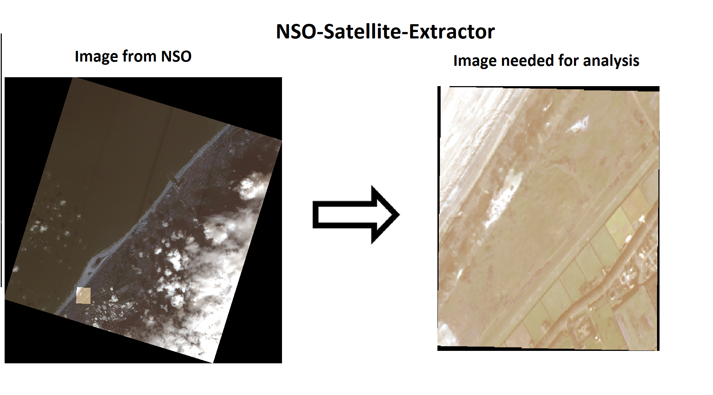
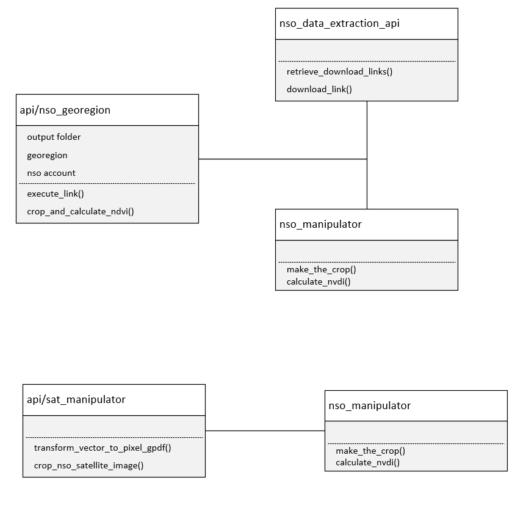

# NSO Satellite Images Extractor

[](https://www.python.org/downloads/)
[](LICENSE)
[](setup.py)

## Overview

A Python package that simplifies extraction, cropping, and processing of satellite image data from the Netherlands Space Office (NSO). Designed for researchers, data scientists, and developers working with large-scale satellite imagery for machine learning, AI applications, and geospatial analysis.

## Key Features

- **✂️ Automated Cropping**: Download, unzip, and crop images to your exact area of interest  
- **📊 Index Calculation**: Compute vegetation and water indices (NDVI, NDWI, etc.)
- **🔄 Batch Processing**: Handle large time-series datasets with automated workflows
- **🗃️ Format Support**: Export as GeoTIFF files or GeoPandas DataFrames




> **⚠️ Important**: This satellite data is only available for Dutch legal entities, institutions, or citizens. 
> See [NSO License Terms](https://www.spaceoffice.nl/nl/satellietdataportaal/toegang-data/licentievoorwaarden/) for details.

## When to Use This Package

- **Research & Academia**: Time-series analysis of environmental changes
- **Machine Learning**: Training datasets for computer vision models
- **GIS Applications**: Preprocessing satellite data for spatial analysis
- **Environmental Monitoring**: Automated vegetation or water body tracking

For occasional use or small datasets, the [NSO Data Portal viewer](https://viewer.satellietdataportaal.nl) may suffice, though manual cropping will still be required.

## Quick Start

### Prerequisites

1. **NSO Account**: Register at the [NSO Data Portal](https://www.satellietdataportaal.nl/) to get your credentials
2. **GeoJSON File**: Create a WGS84 format GeoJSON defining your area of interest using [geojson.io](https://geojson.io) or similar tools

### Configuration

Create a `.env` file in your project root or set environment variables:

```bash
# Required credentials
NSO_USERNAME=your_nso_username
NSO_PASSWORD=your_nso_password

```

Update the paths in the 'settings.py':

```python
# File paths
PATH_GEOJSON=path/to/your/area.geojson
OUTPUT_PATH=path/to/output/directory

# Optional settings
LINKS_MUST_CONTAIN=RGBNED,RGBI  # Filter specific band types
ACCOUNT_URL=your_azure_account_url
PATH_TEST_INPUT_DATA=path/to/test/data

```
### Basic Workflow

1. **Initialize** the NSO georegion object with your credentials and area of interest
2. **Confige** Confige the settings file with th credentials, area of interest and location of where to download the satellite images.
3. **Search** for satellite images covering your region with customizable overlap parameters  
4. **Filter** results by date, resolution, bands, or cloud coverage
5. **Download & Process** images with automatic cropping and optional index calculation

## Example Usage

### Basic Example

```python
import satellite_images_nso_extractor.api.nso_georegion as nso
from settings import nso_username, nso_password, path_geojson, output_path

# Initialize georegion object
georegion = nso.nso_georegion(
    path_to_geojson=path_geojson, 
    output_folder=output_path,
    username=nso_username,
    password=nso_password
)

# Search for satellite images (80% coverage of your region)
links = georegion.retrieve_download_links(
    max_diff=0.8, 
    start_date="2022-01-01",
    cloud_coverage_whole=60
)

# Filter for high-resolution RGB images
high_res_links = links[
    (links['resolution'] == "30cm") & 
    (links["link"].str.contains("RGBNED"))
].sort_values("percentage_geojson")

# Process images with vegetation index calculation
for _, row in high_res_links.iterrows():
    georegion.execute_link(
        row["link"], 
        add_ndvi_band=True,
        delete_zip_file=True,
        plot=False
    )
```

### Advanced Filtering

```python
# Filter by date and satellite type
years = ["2019", "2020", "2021", "2022"]
months = ["05", "06", "07", "08"]  # Growing season

# PNEO high-resolution data
pneo_links = links[
    (links['resolution'] == "30cm") &
    (links["link"].str.contains("RGBNED")) &
    (links['year'].isin(years)) &
    (links['month'].isin(months))
]

# SuperView data for larger areas
superview_links = links[
    (links['resolution'] == "50cm") &
    (links["link"].str.contains("RGBI"))
]
```


> 📓 **See Also**: Check out the complete Jupyter notebook example at `nso_notebook_example.ipynb`

# Class diagram


## Installation

### Method 1: Using Conda (Recommended)

```bash
# Create isolated environment
conda create -n satellite_images_nso_extractor python=3.12 -y
conda activate satellite_images_nso_extractor

# Install dependencies
pip install -r requirements.txt

# Install the package in development mode
pip install -e .
```

### Method 2: Using pip + venv

```bash
# Create virtual environment
python -m venv satellite_env
source satellite_env/bin/activate  # On Windows: satellite_env\Scripts\activate

# Install package and dependencies
pip install -r requirements.txt
pip install -e .
```

### Development Installation

For local development with automatic rebuilding:

```bash
# Windows
rebuild.bat

# Unix/Linux/MacOS
pip install -e . --force-reinstall
```

### Optional Dependencies

**Azure Integration**: For cloud storage and advanced postprocessing:
```bash
pip install azure-cli
az login  # Follow authentication prompts
```

**Cloud Detection**: For automatic cloud filtering (requires separate installation):
```bash
# Follow cloud_recognition package installation instructions
```

### System Requirements

- **Python**: 3.6+ (tested with 3.12)
- **Operating System**: Windows, macOS, Linux
- **Memory**: 4GB+ RAM recommended for large image processing
- **Storage**: Variable (depends on satellite image sizes and processing volume)


## API Reference

### Core Classes

#### `nso_georegion`

Main class for satellite image processing operations.

**Constructor Parameters:**
- `path_to_geojson` (str): Path to WGS84 GeoJSON file defining area of interest
- `output_folder` (str): Directory for processed output files  
- `username` (str): NSO account username
- `password` (str): NSO account password

**Key Methods:**

##### `retrieve_download_links(max_diff, start_date, cloud_coverage_whole=None)`
Search for satellite images covering your region.

- `max_diff` (float): Minimum coverage percentage (0.0-1.0). 1.0 = 100% coverage required
- `start_date` (str): Start date in "YYYY-MM-DD" format
- `cloud_coverage_whole` (int, optional): Maximum acceptable cloud coverage percentage

**Returns:** pandas DataFrame with columns: link, percentage_geojson, date, satellite, resolution

##### `execute_link(link_url, **kwargs)`
Download and process a satellite image.

**Parameters:**
- `link_url` (str): Download URL from retrieve_download_links()
- `add_ndvi_band` (bool): Calculate NDVI vegetation index
- `add_ndwi_band` (bool): Calculate NDWI water index  
- `delete_zip_file` (bool): Remove downloaded ZIP after processing
- `plot` (bool): Generate visualization plots

## Architecture



The package is organized into specialized modules:

- **`api/`**: High-level user interface (`nso_georegion`)
- **`_nso_data_extraction/`**: NSO API communication (`nso_api`)
- **`_manipulation/`**: Image processing and cropping (`nso_manipulator`)
- **`_index_channels/`**: Spectral index calculations (`calculate_index_channels`)
- **`other/`**: Utility functions (`functions`)

## Troubleshooting

### Common Issues

#### Authentication Errors
```
Error: Invalid credentials or authentication failed
```
**Solution**: Verify your NSO username and password. Ensure your account is active and has access to the data portal.

#### Memory Issues with Large Images
```
MemoryError: Unable to allocate array
```
**Solutions**:
- Reduce the `max_diff` parameter to get smaller image tiles
- Process images one at a time instead of batch processing
- Increase system memory or use a machine with more RAM

#### GeoJSON Format Errors
```
Error: Invalid GeoJSON format or coordinate system
```
**Solutions**:
- Ensure GeoJSON uses WGS84 coordinate system (EPSG:4326)
- Validate GeoJSON format using online tools like [geojsonlint.com](https://geojsonlint.com)
- Check that coordinates are in [longitude, latitude] order

#### Missing Dependencies
```
ModuleNotFoundError: No module named 'rasterio'
```
**Solution**: Reinstall dependencies:
```bash
pip install -r requirements.txt --force-reinstall
```

#### Download Failures
```
Error: Failed to download satellite image
```
**Solutions**:
- Check internet connection
- Verify NSO service status
- Try with a smaller date range or different satellite type

### Getting Help

1. **Check logs**: Review `Logging_nso_download.log` for detailed error information
2. **Test data**: Use files in `tests/test_data/` to verify installation
3. **Examples**: Run `nso_notebook_example.ipynb` to test functionality

## Contributing

We welcome contributions! Please follow these guidelines:

### Development Setup

1. Fork the repository
2. Create a virtual environment and install development dependencies:
   ```bash
   pip install -r requirements.txt
   pip install -e .
   ```
3. Install testing dependencies:
   ```bash
   pip install pytest flake8 tox
   ```

### Running Tests

```bash
# Run basic tests (excludes download tests by default)
pytest tests/

# Run all tests including download tests (requires NSO credentials)
pytest tests/ -m ""

# Run only download tests
pytest tests/ -m "download"

# Run with coverage (excluding download tests)
pytest tests/ --cov=satellite_images_nso_extractor

# Run linting
flake8 .

# Test across Python versions
tox
```

**Note**: Download tests require:
- Valid NSO credentials in environment variables
- Internet connection 
- Sufficient disk space (~500MB+ for test data)
- Set `TEST_OUTPUT_PATH` environment variable if you want to use a custom test output directory

### Code Style

- Follow PEP 8 style guidelines
- Use meaningful variable and function names
- Add docstrings for all public methods
- Keep functions focused and modular

### Submitting Changes

1. Create a feature branch: `git checkout -b feature-name`
2. Make your changes with tests
3. Ensure all tests pass: `pytest tests/`
4. Submit a pull request with a clear description

## License

This project is licensed under the MIT License - see the [LICENSE](LICENSE) file for details.

## Changelog

### Version 2.0.0
- Updated NSO API integration
- Added support for Python 3.12
- Improved error handling and logging
- Enhanced cloud detection capabilities
- Added environment variable configuration

### Version 1.x
- Initial release with basic functionality
- Core satellite image extraction and cropping

## Related Projects

- [satellite-images-nso-datascience](https://github.com/Provincie-Zuid-Holland/satellite-images-nso-datascience): Advanced data science tools for NSO satellite imagery

## Support & Contact

- **Issues**: Report bugs and feature requests on [GitHub Issues](https://github.com/Provincie-Zuid-Holland/satellite_images_nso_extractor/issues)
- **Email**: Contact the development team at vdwh@pzh.nl
- **Documentation**: See example notebook and inline documentation for detailed usage

## Authors & Contributors

**Core Development Team:**
- **Michael de Winter** - Lead Developer & Maintainer
- **Pieter Kouyzer** - Core Contributor  
- **Jeroen Esseveld** - Contributor
- **Daniel Overdevest** - Contributor
- **Yilong Wen** - Contributor

## Acknowledgments

- Netherlands Space Office (NSO) for providing satellite data access
- Provincie Zuid-Holland for supporting this open-source initiative
- The Python geospatial community for excellent libraries (rasterio, geopandas, etc.)
